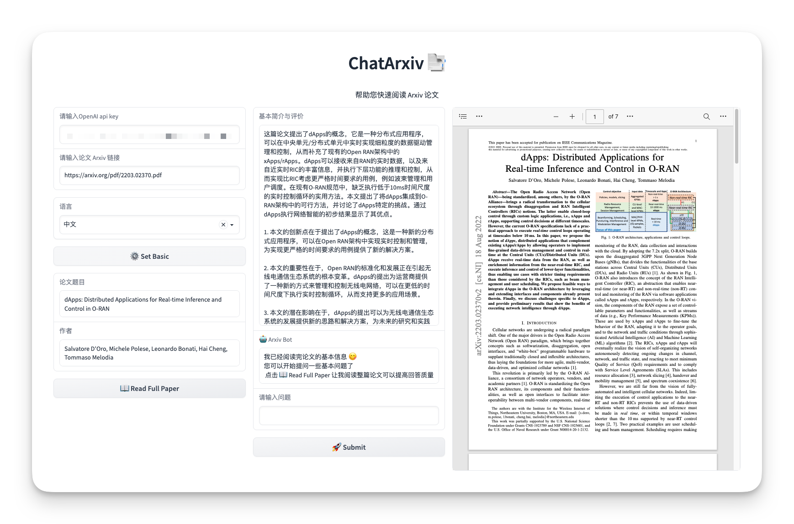

# ChatArxiv 📑
`你的 Arxiv Paper 阅读助手`

---

  <a href="./README.md">中文</a> |
  <a href="./README-en.md">English</a>   

`ChatArxiv` 📑 是一个使用 ChatGPT 作为 Arxiv 论文阅读助手的项目。通过 ChatArxiv，用户可以快速了解和理解 Arxiv 上的学术论文，降低阅读论文的时间成本。用户仅需提供自己的 `OpenAI API` 密钥和对应的 Arxiv 文章链接，即可与 ChatGPT（ArxivBot）进行交流，深入了解论文的详细内容。

## 未来特性

目前正处于开发的早期阶段，以下是我们计划在未来版本中添加的特性：

1. 切换语言：允许用户根据需求切换界面和聊天语言。
2. 切换风格：为用户提供多种聊天风格选项，以满足不同阅读和学习需求。
3. 读图：让 ChatGPT 能够识别和解释论文中的图像、图表和其他视觉内容。
4. PDF 预览：直接在 ChatArxiv 中预览论文的完整 PDF 版本。
5. 历史论文管理：允许用户管理他们阅读过的论文，方便回顾和进一步研究。